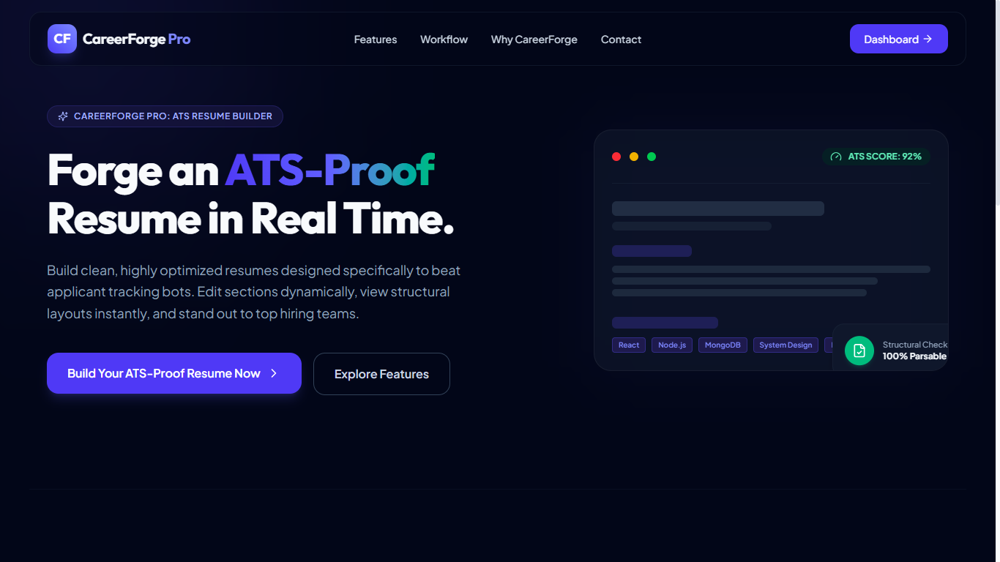
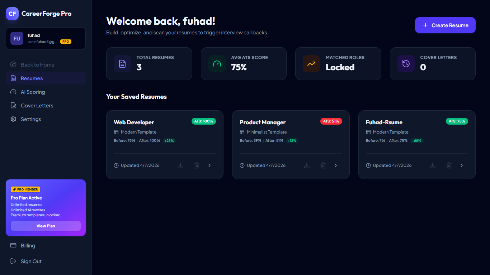
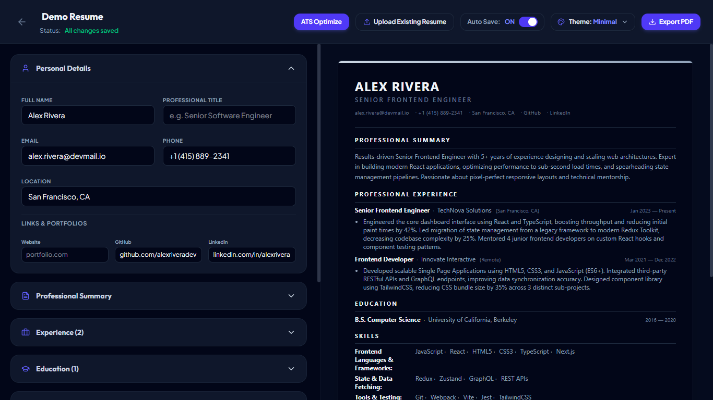
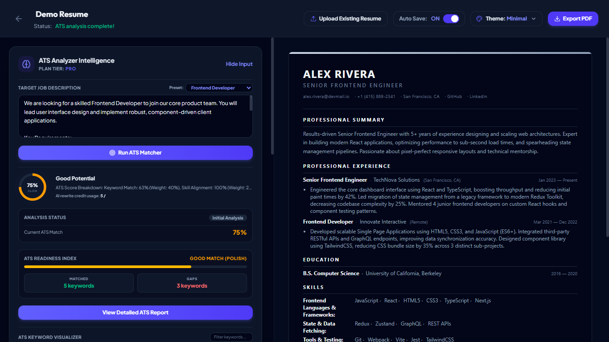
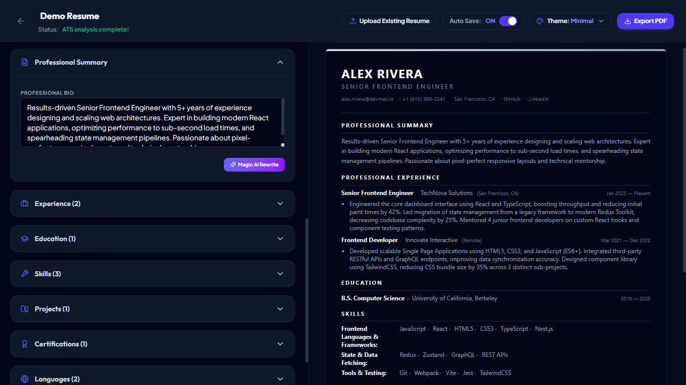
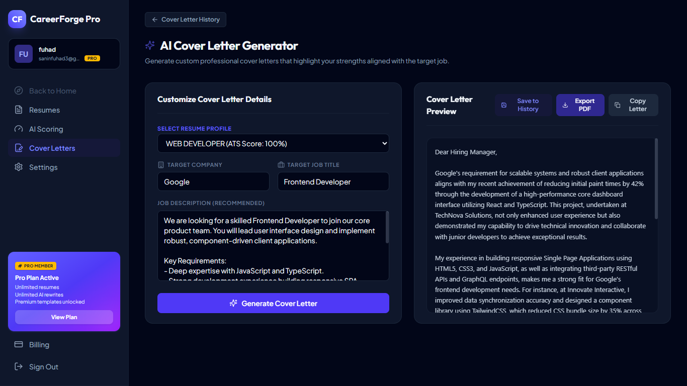
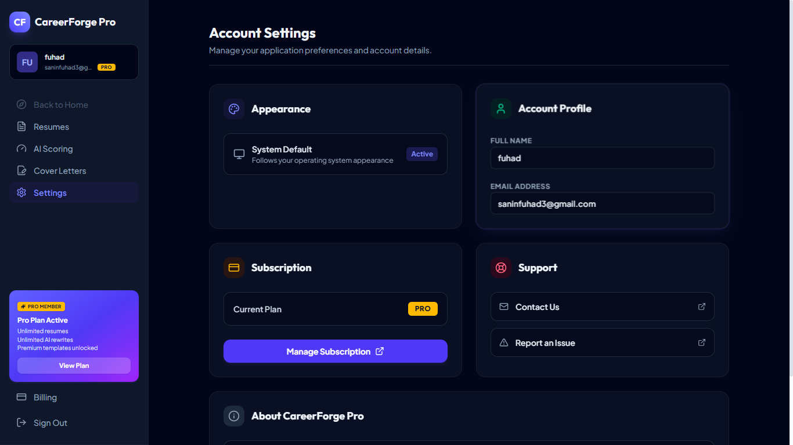
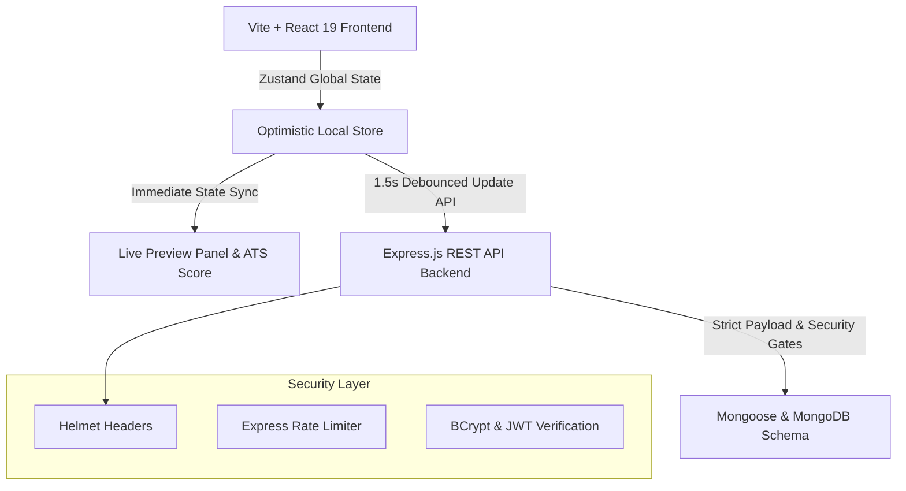

# 🚀 CareerForge Pro: ATS-Proof Resume Generator & Job Matcher

CareerForge Pro is a full-stack SaaS platform built for candidates to create, optimize, and manage resumes. Designed with robust state-management, security protocols, and reactive design, CareerForge Pro features a split-screen builder, template rendering engines, layout sorting, and AI integrations including ATS Optimization, Resume Rewrites, and Cover Letter Generation.

---

## 📑 Table of Contents

- [Core Features](#-core-features)
- [Screenshots](#-screenshots)
- [Tech Stack](#-tech-stack)
- [System Architecture & Data Flow](#️-system-architecture--data-flow)
- [ATS Engine V2.1: Advanced Parsing & Scoring](#-ats-engine-v21-advanced-parsing--scoring)
- [Creative Theme Customizer Compilers](#-creative-theme-customizer-compilers)
- [Project Structure](#-project-structure)
- [Prerequisites & Local Environment](#️-prerequisites--local-environment)
- [Installation & Development](#-installation--development)
- [Environment Variables Reference](#-environment-variables-reference)
- [Deployment](#-deployment)
- [Security Auditing & Production Stability](#-security-auditing--production-stability)
- [Known Limitations](#️-known-limitations)
- [Future Improvements](#-future-improvements)
- [Development Team](#-development-team)

---

## ✨ Core Features

*   **Authentication**: Secure JWT-based user authentication and protected routes.
*   **Resume Builder**: Split-screen editor with live preview and drag-and-drop layout sorting.
*   **Resume Preview**: Live rendering of the resume template.
*   **Upload Resume**: Seamlessly import existing resumes to update your profile.
*   **Auto Save & Save Now**: Robust persistence architecture featuring a 1.5s debounced Auto Save, a manual Save Now button, and a guaranteed save-on-unload fallback.
*   **ATS Optimize Shortcut**: Quick access to the ATS intelligence suite directly from the Builder.
*   **ATS Analyzer Intelligence**: Deep inspection of Job Descriptions against your resume.
*   **ATS Matcher**: Deterministic ATS scoring engine evaluating Keyword Match, Semantic Match, Skill Alignment, and Experience.
*   **ATS Reports**: Highly detailed, actionable compliance reports highlighting keyword gaps and alias matches.
*   **AI Rewrite**: Powerful Llama-3 driven rewriting tools for professional summaries and experience bullets.
*   **Undo**: Revert AI optimizations with built-in history tracking.
*   **Cover Letter Generator**: Generate tailored cover letters matching a target Job Description.
*   **Contact Page**: Dedicated support and inquiry interface.
*   **Settings Page**: Account management and plan statistics.
*   **Theme Switching**: Swap between Modern, Classic, and Minimalist templates.
*   **PDF Export**: Server-side Puppeteer-driven PDF generation.
*   **Responsive UI**: Optimized for all screen sizes using Tailwind CSS v4.

---

## 📸 Screenshots

### Landing Page



### Dashboard



### Resume Builder



### ATS Analyzer



### AI Rewrite



### Cover Letter Generator



### Settings



---

## 💻 Tech Stack

### Frontend
*   **React 19**
*   **Vite**
*   **Tailwind CSS v4**
*   **Zustand** (Global State Management)
*   **Framer Motion** (Animations)

### Backend
*   **Express.js** (REST API)
*   **Node.js**

### AI & Services
*   **Groq API** (Llama-3 LLM for AI Rewrites & Cover Letters)
*   **Puppeteer** (Server-side PDF Export)

### Database
*   **MongoDB** (Atlas / Local Community Server)
*   **Mongoose** (ODM & Strict Schemas)

### Payments
*   **Stripe** (Subscription Billing)

---

## 🏗️ System Architecture & Data Flow



### Key Engineering Paradigms:
1. **Optimistic UI & Debounced Autosave**: The resume editor binds input actions directly to local Zustand store updates, giving the candidate an instantaneous typing preview. All state transitions trigger a **1.5-second debounced backend save**, shielding the database and network from high-frequency REST updates.
2. **Definitive Resume Schema**: Built with highly organized models supporting nested Work Experience, Education, Technical Skill Keywords (for parser detection), Certifications, Projects, Languages, and custom sections.
3. **Reactive Layout Shuffling**: Uses a dedicated layout order array (`sectionOrder`) allowing candidates to rearrange whole resume blocks (e.g. placing Skills above Experience) on the fly, instantly recalculating the preview layout without complex page refreshes.

---

## 📊 ATS Engine V2.1: Advanced Parsing & Scoring

CareerForge Pro utilizes a highly deterministic ATS engine capable of performing comprehensive AI-driven Job Description analysis paired with precise resume matching.

*   **Deterministic Scoring:** Evaluates resumes using strict, predictable mathematical weights: Keyword Match (40%), Semantic Match (30%), Skill Alignment (20%), and Experience Presence (10%).
*   **Server-Authoritative ATS Pipeline:** The backend acts as the single source of truth for all parsing and scoring logic. The frontend dynamically renders ATS metadata without local recalculations, ensuring total data synchronization.
*   **Structured Recommendations:** Provides deterministic, actionable advice categorized by priority levels (Critical, High, Medium, Low) and assigns specific guidance to target resume sections.
*   **Expanded Alias Library:** Supplements dynamic AI-generated aliases with a robust static fallback library of industry-standard terms (e.g., `JavaScript ↔ JS`, `TypeScript ↔ TS`, `Express ↔ Express.js`, `Kubernetes ↔ K8s`, `Amazon Web Services ↔ AWS`).
*   **ATS Report UI V2:** The realtime compliance report correctly exposes point attributions, visualizing true keyword match percentages, structured priority indicators, target section badges, and inline alias context badges, supported by backward-compatible fallback rendering.

*Missing components and keyword gaps trigger actionable ATS optimization warnings, empowering candidates to tailor their resume effortlessly.*

---

## 🎨 Creative Theme Customizer Compilers

CareerForge Pro compiles resumes dynamically into three selectable templates:
*   **Modern**: Uses clean geometric titles with custom accent color dividers, perfect for product and marketing managers.
*   **Classic**: Incorporates traditional serif layouts with centered titles and formal borders, perfect for law, finance, and consulting.
*   **Minimalist**: High line height ratios with ultra-tight spacing and clean structural dividers, designed for creative and technology fields.

---

## 📂 Project Structure

```bash
CareerForge-Pro/
├── backend/
│   ├── src/
│   │   ├── config/          # Mongoose Lifecycle hooks & DB config
│   │   ├── controllers/     # Controller handlers (Auth, Resumes, ATS)
│   │   ├── middleware/      # JWT gates, Rate limits, Body validator pipelines
│   │   ├── models/          # Strict User & Resume schemas
│   │   ├── routes/          # Clean endpoint routes maps
│   │   ├── services/        # AI, PDF, and Stripe integration services
│   │   ├── utils/           # Helper functions and JWT generators
│   │   └── server.js        # Main Express server entry point
│   ├── .env                 # API Secrets & database credentials
│   └── package.json         # Backend dependency scripts
├── frontend/
│   ├── src/
│   │   ├── assets/          # Static media assets
│   │   ├── components/      # Shared elements (Protected routes, Modals)
│   │   ├── pages/           # High-fidelity interfaces (Dashboard, Builder, Cover Letter)
│   │   ├── store/           # Zustand Auth & Resume stores
│   │   ├── index.css        # Tailwind v4 import + Premium theme styles
│   │   ├── main.jsx         # React DOM renderer
│   │   └── App.jsx          # Route controller
│   ├── vite.config.js       # Vite configuration with Tailwind v4 compiler
│   └── package.json         # Frontend UI packages
└── README.md                # System documentation
```

---

## 🛠️ Prerequisites & Local Environment

Ensure you have the following installed on your developer workspace:
- **Node.js**: `v18.0.0` or higher
- **NPM**: `v9.0.0` or higher
- **MongoDB**: Local Community Server instance running on port `27017` (or a MongoDB Atlas connection string)

---

## ⚡ Installation & Development

Follow these step-by-step instructions to boot up the backend and frontend dev instances locally.

### Step 1: Clone & Setup Global Ignores
Check that sensitive credentials and node modules are blocked from Git tracking:
```bash
# Verify .gitignore at the root
node_modules/
.env
dist/
.DS_Store
```

### Step 2: Configure and Run Backend Service
1. Navigate into the backend directory:
   ```bash
   cd backend
   ```
2. Install production and developer dependencies:
   ```bash
   npm install
   ```
3. Initialize the environment configuration. Create a file named `.env` inside `backend/` and configure it according to the Environment Variables reference below.
4. Start the backend development server using Nodemon (which automatically hot-reloads on file edits):
   ```bash
   npm run dev
   ```
   *The backend should print: `Server running on port 5000` and `MongoDB Connected successfully`.*

### Step 3: Configure and Run Frontend Service
1. Open a new terminal tab and navigate into the frontend directory:
   ```bash
   cd ../frontend
   ```
2. Install UI libraries and peer dependencies cleanly:
   ```bash
   npm install --legacy-peer-deps
   ```
3. Boot up the high-speed Vite server with TailwindCSS compiler:
   ```bash
   npm run dev
   ```
   *The frontend dashboard will build and boot on `http://localhost:5173`.*

---

## 🔑 Environment Variables Reference

To successfully run the application with full capabilities, ensure the following environment variables are securely configured. **Never commit actual secret values to version control.**

### Backend (`backend/.env`)
| Variable | Description |
|----------|-------------|
| `PORT` | The port the Express server will listen on (default: `5000`). |
| `NODE_ENV` | Application environment (`development` or `production`). |
| `MONGODB_URI` | MongoDB connection string. |
| `JWT_SECRET` | Secure string for signing JWT authentication tokens. |
| `CLIENT_URL` | The URL of the frontend application (e.g., `http://localhost:5173`). |
| `GROQ_API_KEY` | API Key for Groq (powers Llama-3 AI Rewrite and Generation features). |
| `GROQ_MODEL` | The specific model string for the Groq API (e.g., `llama-3.3-70b-versatile`). |
| `PUPPETEER_EXECUTABLE_PATH` | (Optional) Path to Chromium executable for PDF Export if Puppeteer fails to download it automatically. |
| `STRIPE_SECRET_KEY` | Secret key for Stripe payment processing. |
| `STRIPE_PRICE_ID` | The specific Stripe product price identifier. |
| `STRIPE_WEBHOOK_SECRET` | Secret to verify webhook signatures from Stripe. |

### Frontend (`frontend/.env`)
| Variable | Description |
|----------|-------------|
| `VITE_API_URL` | The URL of the backend REST API (e.g., `http://localhost:5000/api`). |

---

## 🚀 Deployment

To prepare the application for deployment, execute the build process:

### Frontend Build
Navigate to the `frontend` directory and run:
```bash
npm run build
```
This will compile the React application into static assets within the `frontend/dist` directory. The frontend build output is suitable for deployment to static hosting providers such as Vercel or Netlify.

### Backend Hosting
The backend runs as a standard Node.js Express server. Ensure the `NODE_ENV` is set to `production` and provide the required environment variables. The backend can be deployed to a Node.js-compatible hosting provider.

---

## 🔒 Security Auditing & Production Stability

CareerForge Pro has undergone internal code reviews and production readiness validation focused on authentication, data protection, and application stability. The repository incorporates the following practices:
- **Authentication Improvements:** Enhanced **JWT Protection Gates** inside custom middleware securely parse authorization headers to safeguard protected API endpoints.
- **Security Enhancements:** Verified robust data protection leveraging **BCrypt Hashing** for passwords, **Helmet Headers** for XSS mitigation, and **Express Rate Limiting** to prevent brute-force attacks (100 calls/15min).
- **AutoSave Reliability:** Hardened debounced Zustand local store updates ensure that user input is seamlessly and safely synced to MongoDB, protecting against data loss.
- **Production Stabilization:** Repository structure has been refactored for strict separation of concerns, providing a highly scalable API architecture ready for deployment.

---

## ⚠️ Known Limitations

### Payment Gateway
Stripe integration is implemented in the application.
End-to-end payment verification could not be completed because Stripe account creation is unavailable in the developer's region.
A request to use Razorpay as an alternative payment gateway has been submitted and is awaiting company confirmation.

---

## 🔮 Future Improvements

- **Razorpay Support:** Support Razorpay as an alternative payment gateway if approved.
- **Template Gallery Expansion:** Add additional specialized resume templates (e.g., Academic CVs, Engineering specific formats).
- **OAuth Integration:** Add Google and LinkedIn Single Sign-On (SSO) for faster onboarding.

---

## 👥 Development Team

CareerForge Pro is a collaborative team project.

*   **Fuhad Saneen T**
*   **Vaaneesh Prabhakar**

*Modern AI development tools were utilized throughout the lifecycle of this project to assist with architecture reviews, implementation planning, documentation generation, debugging, and overall productivity.*
