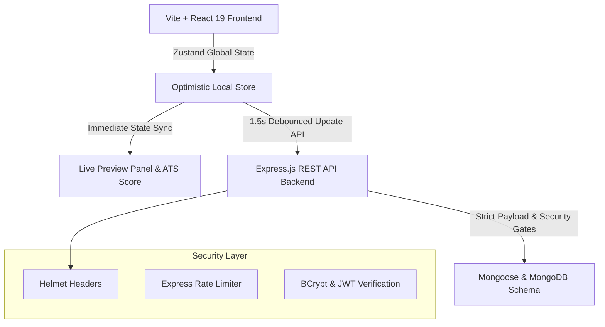

# 🚀 CareerForge Pro: ATS-Proof Resume Generator & Job Matcher

CareerForge Pro is a production-grade, secure, full-stack AI-ready SaaS platform built for professional candidates to create, optimize, and manage ATS-proof resumes. Designed with high-performance state-management, security protocols, and real-time reactive design, CareerForge Pro features an instant split-screen builder, multi-theme template rendering engines, and real-time layout sorting.

---

## 🏗️ System Architecture & Data Flow



### Key Engineering Paradigms:
1. **Optimistic UI & Debounced Autosave**: The resume editor binds input actions directly to local Zustand store updates, giving the candidate an instantaneous typing preview. All state transitions trigger a **1.5-second debounced backend save**, shielding the database and network from high-frequency REST updates.
2. **Definitive Resume Schema**: Built with highly organized models supporting nested Work Experience, Education, Technical Skill Keywords (for parser detection), Certifications, Projects, Languages, and custom sections.
3. **Reactive Layout Shuffling**: Uses a dedicated layout order array (`sectionOrder`) allowing candidates to rearrange whole resume blocks (e.g. placing Skills above Experience) on the fly, instantly recalculating the preview layout without complex page refreshes.

---

## 📂 Repository Layout & Clean Directory Tree

```bash
CareerForge-Pro/
├── backend/
│   ├── src/
│   │   ├── config/          # Mongoose Lifecycle hooks
│   │   ├── controllers/     # Controller handlers (Auth, Resumes, ATS feedback)
│   │   ├── middleware/      # JWT gates, Rate limits, Body validator pipelines
│   │   ├── models/          # Strict User & Resume schemas
│   │   ├── routes/          # Clean endpoint routes maps
│   │   └── server.js        # Main Express server entry point
│   ├── .env                 # API Secrets & database credentials
│   └── package.json         # Backend dependency scripts
├── frontend/
│   ├── src/
│   │   ├── assets/          # Static media assets
│   │   ├── components/      # Shared elements (Protected routes)
│   │   ├── pages/           # High-fidelity interfaces (Landing, Dashboard, Builder)
│   │   ├── store/           # Zustand Auth & Resume stores (Autosave loop)
│   │   ├── index.css        # Tailwind v4 import + Premium theme styles
│   │   ├── main.jsx         # React DOM renderer
│   │   └── App.jsx          # Route controller
│   ├── vite.config.js       # Vite configuration with Tailwind v4 compiler
│   └── package.json         # Frontend UI packages
└── README.md                # System documentation
```

---

## 🛠️ Prerequisites & Local Environment

Ensure you have the following installed on your developer workspace:
- **Node.js**: `v18.0.0` or higher
- **NPM**: `v9.0.0` or higher
- **MongoDB**: Local Community Server instance running on port `27017` (or a MongoDB Atlas connection string)

---

## ⚡ Setup & Launch Instructions

Follow these step-by-step instructions to boot up the backend and frontend dev instances locally.

### Step 1: Clone & Setup Global Ignores
Check that sensitive credentials and node modules are blocked from Git tracking:
```bash
# Verify .gitignore at the root
node_modules/
.env
dist/
.DS_Store
```

### Step 2: Configure and Run Backend Service
1. Navigate into the backend directory:
   ```bash
   cd backend
   ```
2. Install production and developer dependencies:
   ```bash
   npm install
   ```
3. Initialize the environment configuration. Create a file named `.env` inside `backend/` and configure:
   ```env
   PORT=5000
   MONGODB_URI=mongodb://127.0.0.1:27017/careerforge-pro
   JWT_SECRET=cf_pro_super_secret_session_key_2026_xYz
   NODE_ENV=development
   ```
4. Start the backend development server using Nodemon (which automatically hot-reloads on file edits):
   ```bash
   npm run dev
   ```
   *The backend should print: `Server running on port 5000` and `MongoDB Connected successfully`.*

### Step 3: Configure and Run Frontend Service
1. Open a new terminal tab and navigate into the frontend directory:
   ```bash
   cd ../frontend
   ```
2. Install UI libraries and peer dependencies cleanly:
   ```bash
   npm install --legacy-peer-deps
   ```
3. Boot up the high-speed Vite server with TailwindCSS compiler:
   ```bash
   npm run dev
   ```
   *The frontend dashboard will build and boot on `http://localhost:5173`.*

---

## 🔒 Security Auditing & Production Stability

CareerForge Pro has successfully passed an internal security audit and production validation process. The repository has been cleaned and stabilized for production readiness with the following enhancements:
- **Authentication Improvements:** Enhanced **JWT Protection Gates** inside custom middleware securely parse authorization headers to safeguard protected API endpoints.
- **Security Enhancements:** Verified robust data protection leveraging **BCrypt Hashing** for passwords, **Helmet Headers** for XSS mitigation, and **Express Rate Limiting** to prevent brute-force attacks (100 calls/15min).
- **AutoSave Reliability:** Hardened debounced Zustand local store updates ensure that user input is seamlessly and safely synced to MongoDB, protecting against data loss.
- **Production Stabilization:** Repository structure has been refactored for strict separation of concerns, providing a highly scalable API architecture ready for deployment.

---

## 🎨 Creative Theme Customizer Compilers

CareerForge Pro compiles resumes dynamically into three selectable templates:
*   **Modern**: Uses clean geometric titles with custom accent color dividers, perfect for product and marketing managers.
*   **Classic**: Incorporates traditional serif layouts with centered titles and formal borders, perfect for law, finance, and consulting.
*   **Minimalist**: High line height ratios with ultra-tight spacing and clean structural dividers, designed for creative and technology fields.

---

## 📊 ATS Engine V2.1: Advanced Parsing & Scoring
CareerForge Pro utilizes a highly deterministic ATS engine capable of performing comprehensive AI-driven Job Description analysis paired with precise resume matching.

*   **Deterministic Scoring:** Evaluates resumes using strict, predictable mathematical weights: Keyword Match (40%), Semantic Match (30%), Skill Alignment (20%), and Experience Presence (10%).
*   **Server-Authoritative ATS Pipeline:** The backend acts as the single source of truth for all parsing and scoring logic. The frontend dynamically renders ATS metadata without local recalculations, ensuring total data synchronization.
*   **Structured Recommendations:** Provides deterministic, actionable advice categorized by priority levels (Critical, High, Medium, Low) and assigns specific guidance to target resume sections.
*   **Expanded Alias Library:** Supplements dynamic AI-generated aliases with a robust static fallback library of industry-standard terms (e.g., `JavaScript ↔ JS`, `TypeScript ↔ TS`, `Express ↔ Express.js`, `Kubernetes ↔ K8s`, `Amazon Web Services ↔ AWS`).
*   **ATS Report UI V2:** The realtime compliance report correctly exposes point attributions, visualizing true keyword match percentages, structured priority indicators, target section badges, and inline alias context badges, supported by backward-compatible fallback rendering.

*Missing components and keyword gaps trigger actionable ATS optimization warnings, empowering candidates to tailor their resume effortlessly.*

---

## 🧑‍💻 Pair Programming Team
Designed and constructed with 💙 by **Antigravity** and the **Google DeepMind developer team**.
