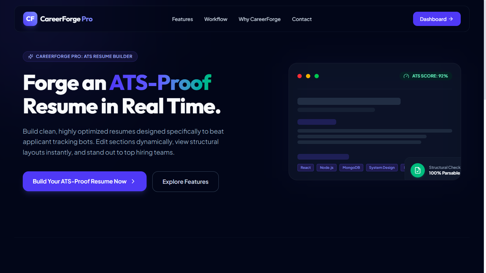
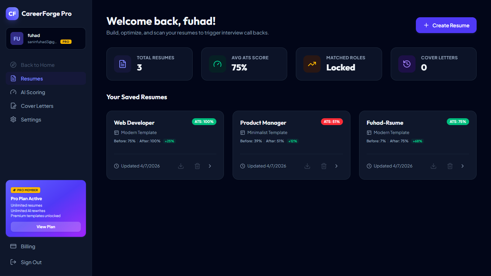
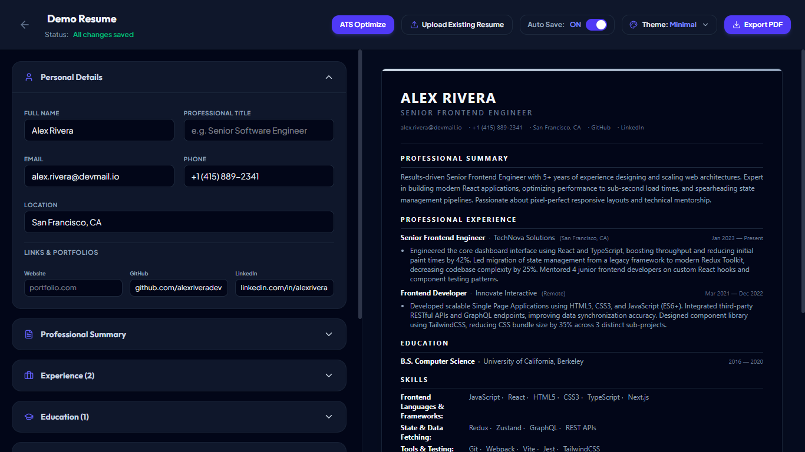
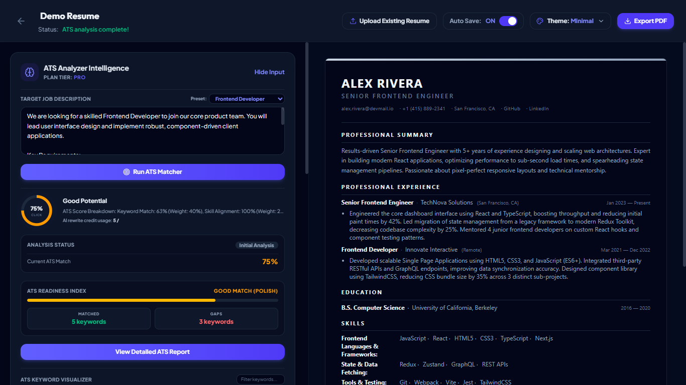
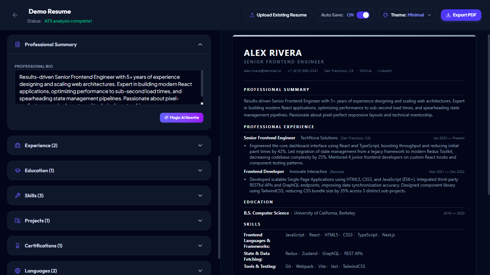
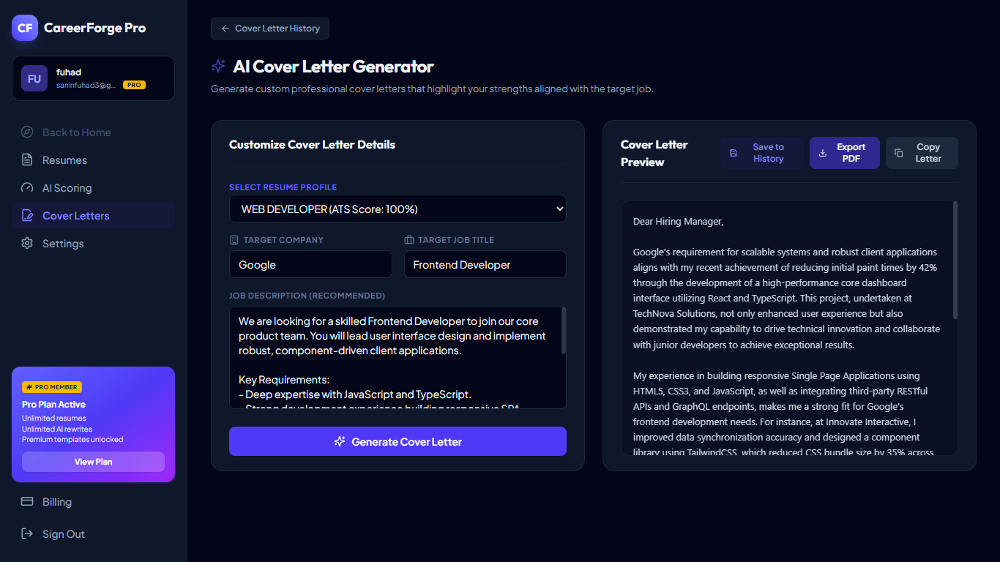
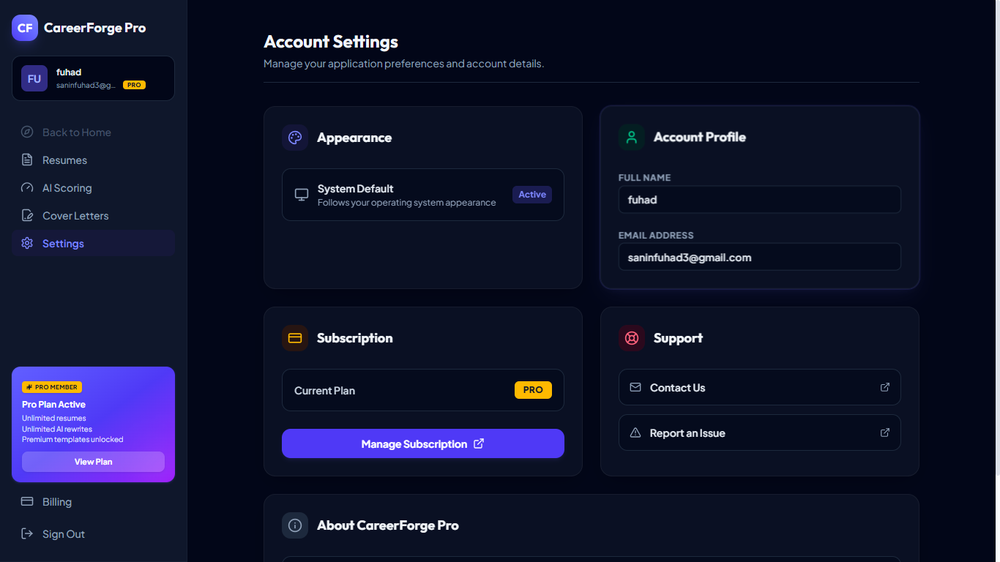
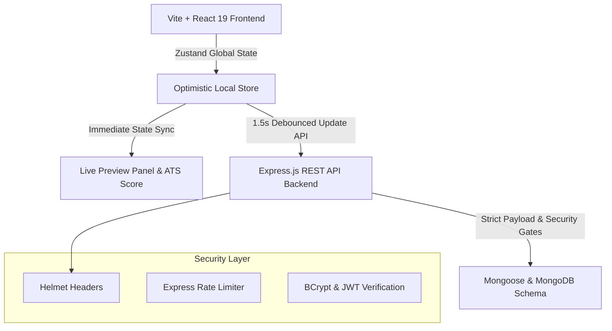

# 🚀 CareerForge Pro: ATS-Proof Resume Generator & Job Matcher

CareerForge Pro is a full-stack SaaS platform built for candidates to create, optimize, and manage resumes. Designed with robust state-management, security protocols, and reactive design, CareerForge Pro features a split-screen builder, template rendering engines, layout sorting, and AI integrations including ATS Optimization, Resume Rewrites, and Cover Letter Generation.

---

## 📑 Table of Contents

- [Core Features](#-core-features)
- [Screenshots](#-screenshots)
- [Tech Stack](#-tech-stack)
- [System Architecture & Data Flow](#️-system-architecture--data-flow)
- [ATS Engine V2.1: Advanced Parsing & Scoring](#-ats-engine-v21-advanced-parsing--scoring)
- [Creative Theme Customizer Compilers](#-creative-theme-customizer-compilers)
- [Project Structure](#-project-structure)
- [Prerequisites & Local Environment](#️-prerequisites--local-environment)
- [Installation & Development](#-installation--development)
- [Environment Variables Reference](#-environment-variables-reference)
- [Billing & Subscriptions](#-billing--subscriptions)
- [Local Webhook Testing](#-local-webhook-testing)
- [Deployment](#-deployment)
- [Security Auditing & Production Stability](#-security-auditing--production-stability)
- [Known Limitations](#️-known-limitations)
- [Future Improvements](#-future-improvements)
- [Development Team](#-development-team)


---

## ✨ Core Features

*   **Authentication**: Secure JWT-based user authentication and protected routes.
*   **Resume Builder**: Split-screen editor with live preview and drag-and-drop layout sorting.
*   **Resume Preview**: Live rendering of the resume template.
*   **Upload Resume**: Seamlessly import existing resumes to update your profile.
*   **Auto Save & Save Now**: Robust persistence architecture featuring a 1.5s debounced Auto Save, a manual Save Now button, and a guaranteed save-on-unload fallback.
*   **ATS Optimize Shortcut**: Quick access to the ATS intelligence suite directly from the Builder.
*   **ATS Analyzer Intelligence**: Deep inspection of Job Descriptions against your resume.
*   **ATS Matcher**: Deterministic ATS scoring engine evaluating Keyword Match, Semantic Match, Skill Alignment, and Experience.
*   **ATS Reports**: Highly detailed, actionable compliance reports highlighting keyword gaps and alias matches.
*   **AI Rewrite**: Powerful Llama-3 driven rewriting tools for professional summaries and experience bullets.
*   **Undo**: Revert AI optimizations with built-in history tracking.
*   **Cover Letter Generator**: Generate tailored cover letters matching a target Job Description.
*   **Contact Page**: Dedicated support and inquiry interface.
*   **Settings Page**: Account management and plan statistics.
*   **Theme Switching**: Swap between Modern, Classic, and Minimalist templates.
*   **PDF Export**: Server-side Puppeteer-driven PDF generation.
*   **Responsive UI**: Optimized for all screen sizes using Tailwind CSS v4.

---

## 📸 Screenshots

### Landing Page



### Dashboard



### Resume Builder



### ATS Analyzer



### AI Rewrite



### Cover Letter Generator



### Settings



---

## 💻 Tech Stack

### Frontend
*   **React 19**
*   **Vite**
*   **Tailwind CSS v4**
*   **Zustand** (Global State Management)
*   **Framer Motion** (Animations)

### Backend
*   **Express.js** (REST API)
*   **Node.js**

### AI & Services
*   **Groq API** (Llama-3 LLM for AI Rewrites & Cover Letters)
*   **Puppeteer** (Server-side PDF Export)

### Database
*   **MongoDB** (Atlas / Local Community Server)
*   **Mongoose** (ODM & Strict Schemas)

### Payments
*   **Razorpay** (Primary subscription billing — Test Mode operational)
*   **Stripe** (Alternative subscription billing — also integrated)

---

## 🏗️ System Architecture & Data Flow


```mermaid
graph TD
    A[Vite + React 19 Frontend] -->|Zustand Global State| B[Optimistic Local Store]
    B -->|Immediate State Sync| C[Live Preview Panel & ATS Score]
    B -->|1.5s Debounced Update API| D[Express.js REST API Backend]
    D -->|Strict Payload & Security Gates| E[Mongoose & MongoDB Schema]
    
    subgraph Security Layer
        F[Helmet Headers]
        G[Express Rate Limiter]
        H[BCrypt & JWT Verification]
    end
    D --> F
```

### Key Engineering Paradigms:
1. **Optimistic UI & Debounced Autosave**: The resume editor binds input actions directly to local Zustand store updates, giving the candidate an instantaneous typing preview. All state transitions trigger a **1.5-second debounced backend save**, shielding the database and network from high-frequency REST updates.
2. **Definitive Resume Schema**: Built with highly organized models supporting nested Work Experience, Education, Technical Skill Keywords (for parser detection), Certifications, Projects, Languages, and custom sections.
3. **Reactive Layout Shuffling**: Uses a dedicated layout order array (`sectionOrder`) allowing candidates to rearrange whole resume blocks (e.g. placing Skills above Experience) on the fly, instantly recalculating the preview layout without complex page refreshes.

---

## 📊 ATS Engine V2.1: Advanced Parsing & Scoring

CareerForge Pro utilizes a highly deterministic ATS engine capable of performing comprehensive AI-driven Job Description analysis paired with precise resume matching.

*   **Deterministic Scoring:** Evaluates resumes using strict, predictable mathematical weights: Keyword Match (40%), Semantic Match (30%), Skill Alignment (20%), and Experience Presence (10%).
*   **Server-Authoritative ATS Pipeline:** The backend acts as the single source of truth for all parsing and scoring logic. The frontend dynamically renders ATS metadata without local recalculations, ensuring total data synchronization.
*   **Structured Recommendations:** Provides deterministic, actionable advice categorized by priority levels (Critical, High, Medium, Low) and assigns specific guidance to target resume sections.
*   **Expanded Alias Library:** Supplements dynamic AI-generated aliases with a robust static fallback library of industry-standard terms (e.g., `JavaScript ↔ JS`, `TypeScript ↔ TS`, `Express ↔ Express.js`, `Kubernetes ↔ K8s`, `Amazon Web Services ↔ AWS`).
*   **ATS Report UI V2:** The realtime compliance report correctly exposes point attributions, visualizing true keyword match percentages, structured priority indicators, target section badges, and inline alias context badges, supported by backward-compatible fallback rendering.

*Missing components and keyword gaps trigger actionable ATS optimization warnings, empowering candidates to tailor their resume effortlessly.*

---

## 🎨 Creative Theme Customizer Compilers

CareerForge Pro compiles resumes dynamically into three selectable templates:
*   **Modern**: Uses clean geometric titles with custom accent color dividers, perfect for product and marketing managers.
*   **Classic**: Incorporates traditional serif layouts with centered titles and formal borders, perfect for law, finance, and consulting.
*   **Minimalist**: High line height ratios with ultra-tight spacing and clean structural dividers, designed for creative and technology fields.

---

## 📂 Project Structure

```bash
CareerForge-Pro/
├── backend/
│   ├── src/
│   │   ├── config/          # Mongoose Lifecycle hooks & DB config
│   │   ├── controllers/     # Controller handlers (Auth, Resumes, ATS)
│   │   ├── middleware/      # JWT gates, Rate limits, Body validator pipelines
│   │   ├── models/          # Strict User & Resume schemas
│   │   ├── routes/          # Clean endpoint routes maps
│   │   ├── services/        # AI, PDF, Stripe, and Razorpay integration services
│   │   ├── utils/           # Helper functions and JWT generators
│   │   └── server.js        # Main Express server entry point
│   ├── .env                 # API Secrets & database credentials
│   └── package.json         # Backend dependency scripts
├── frontend/
│   ├── src/
│   │   ├── assets/          # Static media assets
│   │   ├── components/      # Shared elements (Protected routes, Modals)
│   │   ├── pages/           # High-fidelity interfaces (Dashboard, Builder, Cover Letter)
│   │   ├── store/           # Zustand Auth & Resume stores
│   │   ├── index.css        # Tailwind v4 import + Premium theme styles
│   │   ├── main.jsx         # React DOM renderer
│   │   └── App.jsx          # Route controller
│   ├── vite.config.js       # Vite configuration with Tailwind v4 compiler
│   └── package.json         # Frontend UI packages
└── README.md                # System documentation
```

---

## 🛠️ Prerequisites & Local Environment

Ensure you have the following installed on your developer workspace:
- **Node.js**: `v18.0.0` or higher
- **NPM**: `v9.0.0` or higher
- **MongoDB**: Local Community Server instance running on port `27017` (or a MongoDB Atlas connection string)

---

## ⚡ Installation & Development

Follow these step-by-step instructions to boot up the backend and frontend dev instances locally.

### Step 1: Clone & Setup Global Ignores
Check that sensitive credentials and node modules are blocked from Git tracking:
```bash
# Verify .gitignore at the root
node_modules/
.env
dist/
.DS_Store
```

### Step 2: Configure and Run Backend Service
1. Navigate into the backend directory:
   ```bash
   cd backend
   ```
2. Install production and developer dependencies:
   ```bash
   npm install
   ```
3. Initialize the environment configuration. Create a file named `.env` inside `backend/` and configure it according to the Environment Variables reference below.
4. Start the backend development server using Nodemon (which automatically hot-reloads on file edits):
   ```bash
   npm run dev
   ```
   *The backend will print startup messages such as `[MongoDB] Attempting to connect to database...` and `[MongoDB] Connected successfully to host: <hostname>` on successful connection.*

### Step 3: Configure and Run Frontend Service
1. Open a new terminal tab and navigate into the frontend directory:
   ```bash
   cd ../frontend
   ```
2. Install UI libraries and peer dependencies cleanly:
   ```bash
   npm install --legacy-peer-deps
   ```
3. Boot up the high-speed Vite server with TailwindCSS compiler:
   ```bash
   npm run dev
   ```
   *The frontend dashboard will build and boot on `http://localhost:5173`.*

---

## 🔑 Environment Variables Reference

To successfully run the application with full capabilities, ensure the following environment variables are securely configured. **Never commit actual secret values to version control.**

### Backend (`backend/.env`)
| Variable | Description |
|----------|-------------|
| `PORT` | The port the Express server will listen on (default: `5000`). |
| `NODE_ENV` | Application environment (`development` or `production`). |
| `MONGODB_URI` | MongoDB connection string. |
| `JWT_SECRET` | Secure string for signing JWT authentication tokens. |
| `CLIENT_URL` | The URL of the frontend application (e.g., `http://localhost:5173`). |
| `GROQ_API_KEY` | API Key for Groq (powers Llama-3 AI Rewrite and Generation features). |
| `GROQ_MODEL` | The specific model string for the Groq API (e.g., `llama-3.3-70b-versatile`). |
| `PUPPETEER_EXECUTABLE_PATH` | (Optional) Path to Chromium executable for PDF Export if Puppeteer fails to download it automatically. |
| `STRIPE_SECRET_KEY` | Secret key for Stripe payment processing. |
| `STRIPE_PRICE_ID` | The specific Stripe product price identifier. |
| `STRIPE_WEBHOOK_SECRET` | Secret to verify webhook signatures from Stripe. |
| `RAZORPAY_KEY_ID` | Public Razorpay API key used by the Checkout integration. Supplied to the frontend by the backend at checkout time — do not expose via a frontend environment variable. |
| `RAZORPAY_KEY_SECRET` | Private Razorpay API secret. **Backend-only. Never expose to the frontend or commit to version control.** |
| `RAZORPAY_WEBHOOK_SECRET` | Private secret used to verify Razorpay webhook HMAC-SHA256 signatures against the `X-Razorpay-Signature` header. |
| `RAZORPAY_PLAN_ID` | Razorpay subscription Plan ID configured for the application in the Razorpay Dashboard. Use a Test Plan ID for development and a Live Plan ID for production. |

### Frontend (`frontend/.env`)

`frontend/.env` does not exist by default. Create it if you need to point the frontend at a custom backend URL (e.g., in production or when using a remote development server):

```env
VITE_API_URL=https://your-api-domain.example/api
```

For local development, the frontend falls back to `/api` (Vite proxy) or `http://localhost:5000/api` depending on the page. The Razorpay Key ID is **not** configured in the frontend environment — it is returned by the backend at checkout time.

| Variable | Description |
|----------|-------------|
| `VITE_API_URL` | The URL of the backend REST API. Required in production. Falls back to `/api` in local development. |

---

## 💳 Billing & Subscriptions

CareerForge Pro supports subscription-based Pro plan billing through Razorpay (primary) and Stripe (alternative).

### Providers

| Provider | Status | Role |
|----------|--------|------|
| **Razorpay** | ✅ Operational (Test Mode) | Primary subscription provider |
| **Stripe** | ✅ Integrated | Alternative subscription provider |

Provider-specific subscription IDs are stored separately in the user record. The active provider is tracked via `subscriptionProvider` (`razorpay` \| `stripe` \| `none`).

### Razorpay Checkout Flow

```
FREE user clicks "Upgrade to Pro"
  → Frontend calls backend: POST /api/billing/create-razorpay-subscription
  → Backend creates a Razorpay subscription using the server-controlled Plan ID
  → Backend returns subscriptionId and keyId to the frontend
  → Razorpay Checkout modal opens in the browser
  → User completes payment
  → Razorpay returns payment details to the handler callback
  → Frontend sends razorpay_payment_id, razorpay_subscription_id,
    razorpay_signature to backend: POST /api/billing/verify-razorpay-payment
  → Backend verifies the HMAC-SHA256 signature
  → On success: user.plan = PRO, subscriptionStatus = active
```

> The Plan ID and amount are **server-controlled**. The client cannot modify the subscription price or plan.

### Razorpay Webhook Endpoint

```
POST /api/billing/razorpay-webhook
```

- Webhook signature is verified using `RAZORPAY_WEBHOOK_SECRET` and the `X-Razorpay-Signature` header (HMAC-SHA256).
- The raw request body (Buffer) is required for signature verification. The webhook route is mounted **before** `express.json()` in `server.js`.
- Subscription ID ownership is validated on every event — stale or cross-account events are rejected.

### Supported Razorpay Events

| Event | `plan` | `subscriptionStatus` |
|-------|--------|----------------------|
| `subscription.authenticated` | — | — |
| `subscription.activated` | `PRO` | `active` |
| `subscription.charged` | `PRO` | `active` |
| `subscription.pending` | `PRO` | `past_due` *(grace period — see below)* |
| `subscription.halted` | `FREE` | `past_due` |
| `subscription.paused` | `FREE` | `paused` |
| `subscription.resumed` | `PRO` | `active` |
| `subscription.cancelled` | `FREE` | `canceled` |

### Grace Period (`subscription.pending`)

When a recurring payment charge fails, Razorpay retries automatically and moves the subscription to `pending`. During this retry window, CareerForge applies a soft grace-period policy:

- `user.plan` remains `PRO`
- `user.subscriptionStatus` is set to `past_due`
- Pro access is **preserved** during the retry period

If retries are exhausted, Razorpay sends `subscription.halted` and Pro access is revoked.

> **Testing status:** The `subscription.pending` handler is implemented and covered by automated in-memory tests. A genuine end-to-end recurring-charge failure and retry cycle through Razorpay Test Mode was **not conclusively demonstrated** during development. End-to-end behavior should be validated before production launch.

### Customer Cancellation

Active Razorpay subscribers can cancel their subscription from the **Billing Details** page:

- **Default behavior:** Cancel at the end of the current billing period. Pro access is retained until `subscriptionExpiresAt`.
- The backend derives the subscription ID from the authenticated user's session — client-supplied subscription IDs are not accepted.
- Razorpay processes the cancellation and later emits `subscription.cancelled`, which triggers final entitlement revocation (`plan = FREE`, `subscriptionStatus = canceled`).

---

## 🔗 Local Webhook Testing

Razorpay cannot deliver webhooks to `localhost` directly. During local development, expose the backend using a public tunnel such as [zrok](https://zrok.io) or [ngrok](https://ngrok.com).

### Example (zrok)

```bash
zrok2 share public localhost:5000
```

This will output a public HTTPS URL. Configure it as your Razorpay webhook endpoint:

```
https://<current-tunnel-host>.shares.zrok.io/api/billing/razorpay-webhook
```

### Important Notes

- Tunnel URLs are **temporary**. When the tunnel restarts, the URL changes and must be re-registered in the Razorpay Dashboard.
- Set the webhook secret in `backend/.env` as `RAZORPAY_WEBHOOK_SECRET` and configure the same secret in the Razorpay Dashboard webhook settings.
- **Do not commit a tunnel URL as a permanent webhook configuration.** A public tunnel is for local development only — production requires a stable HTTPS URL from the deployed backend.

### Test Mode vs Live Mode

#### Razorpay Test Mode (Local Development)
- Use `rzp_test_…` key credentials
- Use the Test Plan ID from the Razorpay Test Dashboard
- Use the Test webhook secret
- Use a local tunnel for webhook delivery

#### Razorpay Live Mode (Production)
- Use `rzp_live_…` key credentials
- Create a Live subscription Plan and use its Live Plan ID
- Use the Live webhook secret
- Register the production backend's stable HTTPS URL as the webhook endpoint
- Live Mode is **not currently configured** — see [Known Limitations](#️-known-limitations)

---

## 🚀 Deployment

### Frontend Build

Navigate to the `frontend` directory and run:
```bash
npm run build
```
This will compile the React application into static assets within the `frontend/dist` directory. The output is suitable for deployment to static hosting providers such as Vercel or Netlify.

Set `VITE_API_URL` in your hosting platform's environment configuration to point to the production backend:
```
VITE_API_URL=https://your-backend-domain.example/api
```

### Backend Hosting

The backend runs as a standard Node.js Express server and can be deployed to any Node.js-compatible hosting provider. For production:

- Set `NODE_ENV=production`
- Set `CLIENT_URL` to the deployed frontend URL (used for CORS)
- Provide a stable `MONGODB_URI` for your production Atlas cluster
- Provide secure values for all secrets: `JWT_SECRET`, Stripe keys, Razorpay keys
- Ensure the server is reachable over **HTTPS** (required for Razorpay webhook delivery)

### Razorpay Live Mode Configuration

Local development uses Razorpay **Test Mode** credentials. Before going live:

1. Obtain **Live API keys** (`rzp_live_…`) from the Razorpay Dashboard.
2. Create a **Live subscription Plan** and note its Plan ID.
3. Generate a **Live webhook secret** in the Razorpay Dashboard.
4. Update environment variables:
   - `RAZORPAY_KEY_ID` → Live key ID
   - `RAZORPAY_KEY_SECRET` → Live key secret
   - `RAZORPAY_WEBHOOK_SECRET` → Live webhook secret
   - `RAZORPAY_PLAN_ID` → Live Plan ID
5. Register the production webhook endpoint in the Razorpay Dashboard:
   ```
   https://your-backend-domain.example/api/billing/razorpay-webhook
   ```

> **Important:** A public tunnel such as zrok or ngrok is for **local development and testing only**. It must not be used as the permanent production webhook endpoint. Production requires a stable HTTPS URL tied to the deployed backend.


## 🔒 Security Auditing & Production Stability

CareerForge Pro has undergone internal code reviews and production readiness validation focused on authentication, data protection, and application stability. The repository incorporates the following practices:
- **Authentication Improvements:** Enhanced **JWT Protection Gates** inside custom middleware securely parse authorization headers to safeguard protected API endpoints.
- **Security Enhancements:** Verified robust data protection leveraging **BCrypt Hashing** for passwords, **Helmet Headers** for XSS mitigation, and **Express Rate Limiting** to prevent brute-force attacks (100 calls/15min).
- **AutoSave Reliability:** Hardened debounced Zustand local store updates ensure that user input is seamlessly and safely synced to MongoDB, protecting against data loss.
- **Production Stabilization:** Repository structure has been refactored for strict separation of concerns, providing a highly scalable API architecture ready for deployment.

### Billing Security

- `RAZORPAY_KEY_SECRET` and `RAZORPAY_WEBHOOK_SECRET` are **backend-only**. They must never be sent to the frontend or committed to version control.
- Razorpay payment signatures are **verified server-side** using HMAC-SHA256 before any Pro entitlement is granted.
- Razorpay webhook signatures are **verified against the raw request body** using the `X-Razorpay-Signature` header and `RAZORPAY_WEBHOOK_SECRET`. The webhook route is mounted before `express.json()` to preserve the raw buffer.
- Subscription cancellation derives the subscription ID from the **authenticated server session** — client-supplied subscription IDs are not trusted.
- Backend feature gates are **authoritative for Pro access**. Frontend plan state is synchronized from the backend on every billing page load.
- MongoDB startup logs have been sanitized to exclude the connection URI. Credentials are not written to application logs.
- `.env` files must never be committed to version control.


---

## ⚠️ Known Limitations

### Razorpay Live Mode

Razorpay subscription billing is implemented and operational in **Test Mode**, including checkout, server-side payment verification, webhook signature verification, full subscription lifecycle handling, and customer-facing cancellation. Production deployment requires configuring Razorpay **Live Mode** credentials, a production Plan ID, a stable HTTPS webhook endpoint, and re-registering the webhook in the Razorpay Dashboard.

### Pending/Grace-Period Verification

The `subscription.pending` grace-period handler (which retains Pro access during a payment retry window) is implemented and covered by automated in-memory tests. A genuine end-to-end recurring-charge failure and retry cycle through Razorpay Test Mode was not conclusively demonstrated during development testing. End-to-end behavior should be validated before production launch.


---

## 🔮 Future Improvements

- **Template Gallery Expansion:** Add additional specialized resume templates (e.g., Academic CVs, Engineering specific formats).
- **OAuth Integration:** Add Google and LinkedIn Single Sign-On (SSO) for faster onboarding.
- **Razorpay Live Mode Launch:** Complete Live Mode configuration, end-to-end verification of the subscription lifecycle (including the payment retry/grace-period flow), and production webhook registration.


---

## 👥 Development Team

CareerForge Pro is a collaborative team project.

*   **Fuhad Saneen T**
*   **Vaaneesh Prabhakar**

*Modern AI development tools were utilized throughout the lifecycle of this project to assist with architecture reviews, implementation planning, documentation generation, debugging, and overall productivity.*
